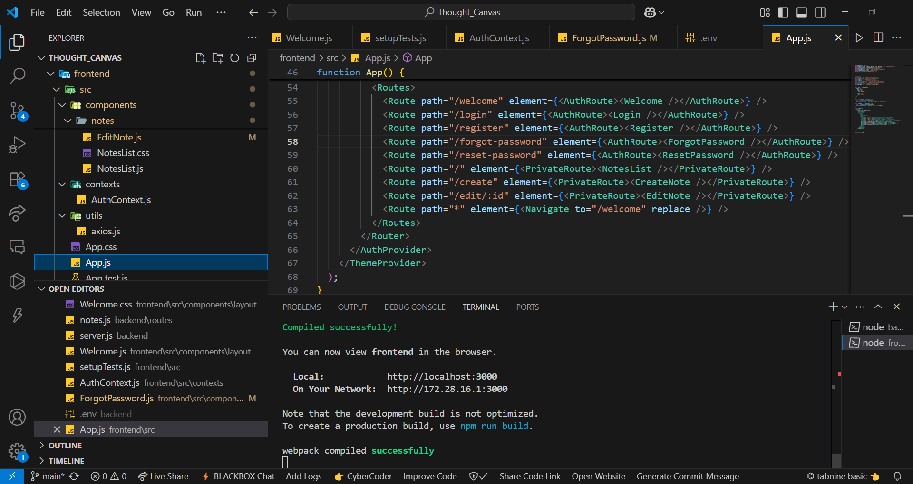

# Thought Canvas

Thought Canvas is a MERN stack notes-making application that allows users to create, manage, and share notes securely. The application features user authentication, note management, and sharing functionalities via email.

## 🚀 Features

- **User Authentication**: 
  - Sign up with basic information (name, email, password).
  - Log in with email and password.
  - Password reset functionality via email.

- **Note Management**:
  - Create, edit, and delete notes.
  - View a list of all notes.

- **Responsive Design**: 
  - Built with Material-UI for a modern and responsive user interface.

## 🛠️ Tech Stack

- MongoDB: Database
- Express.js: Backend framework
- React: Frontend library
- Node.js: Runtime environment
- JWT: Authentication
- bcrypt: Password hashing


## 🖼️ Preview

| Code View | Welcome Page | Dashboard | Create Note |
|-----------|-------------|---------------|-----------|
|  |  |  |  |

---

## 📝 Getting Started

### Prerequisites

- Node.js (v14 or higher)
- MongoDB

### Installation

1. Clone the repository:
   ```bash
   git clone https://github.com/Nithanantoj/Thought-canvas.git
   cd thought-canvas
   ```
2. Install backend dependencies:
   ```bash
   cd backend
   npm install
   ```
3. Install frontend dependencies:
   ```bash
   cd frontend
   npm install
   ```

### Running the Application

1. Start the backend server:
   ```bash
   cd backend
   npm start
   ```

2. Start the frontend development server:
   ```bash
   cd frontend
   npm start
   ```

## 🔐 Environment Variables

Create `.env` files in both backend and frontend directories with the following variables:

### Backend (.env)
```
MONGODB_URI=your_mongodb_connection_string
JWT_SECRET=your_jwt_secret
PORT=5000
EMAIL_SERVICE=your_email_service
EMAIL_USER=your_email
EMAIL_PASS=your_email_password
WHATSAPP_API_KEY=your_whatsapp_api_key
```

### Frontend (.env)
```
REACT_APP_API_URL=http://localhost:5000
```
